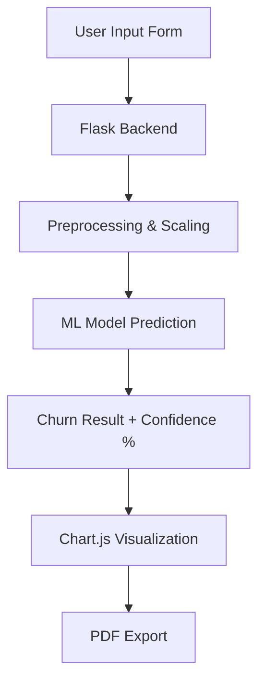
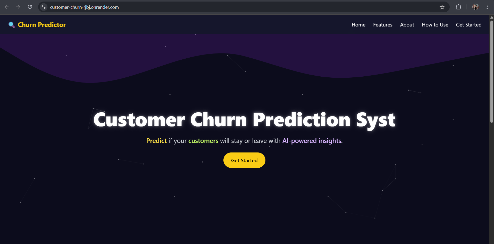
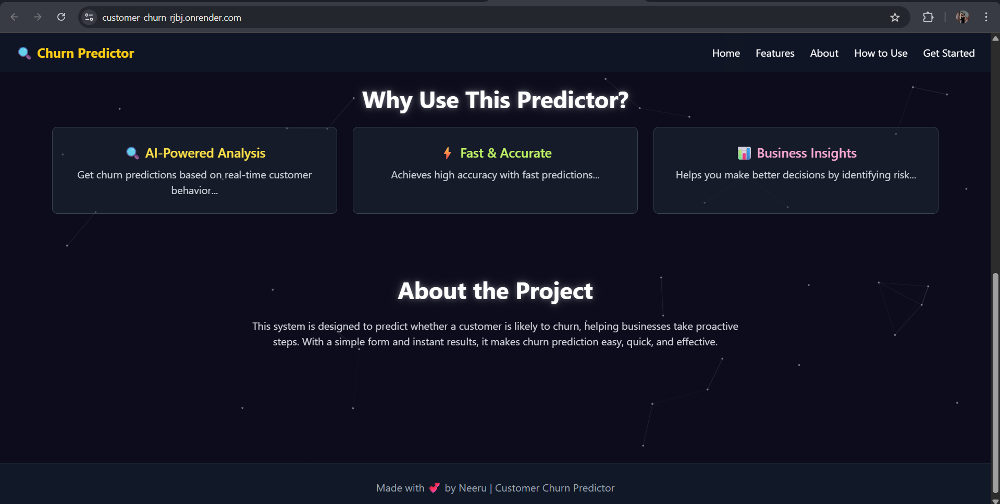
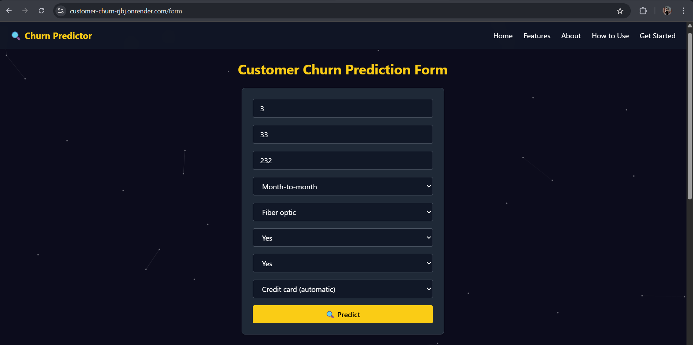
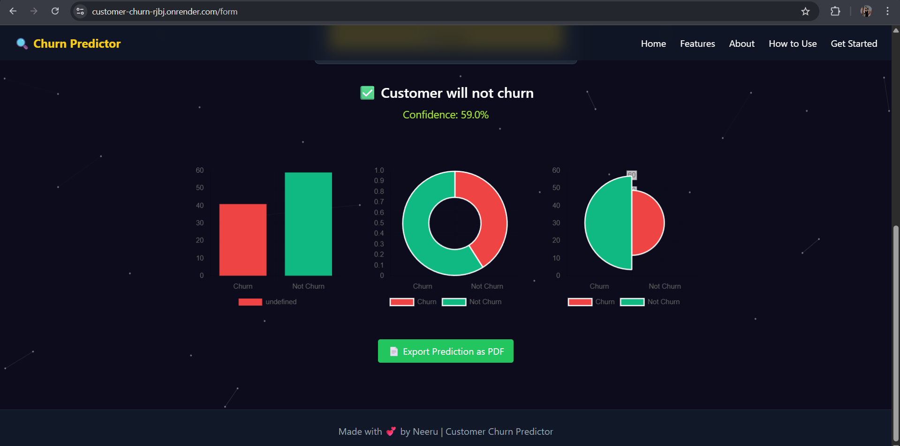

# 🔍 Customer Churn Predictor


> An intelligent AI/ML-based web application that enables businesses to **predict customer churn** by analyzing behavioral and billing patterns. Designed with a clean Tailwind-powered UI, real-time visualizations, and PDF export capabilities, this tool streamlines retention strategies for telecom and subscription-based industries.

---
## 🔍 Overview

Customer churn refers to when an existing customer stops doing business with a company. This predictor uses a **supervised machine learning pipeline** to analyze structured customer data and forecast churn probability with precision. The app serves as a decision-support system for customer success teams.

---
## 🚀 Key Capabilities


  


---


## ⚙️ Architecture



---
## 📸 UI Snapshots

<table>
  <tr>
    <td></td>
    <td></td>
  </tr>
   <tr>
    <td></td>
    <td></td>
  </tr>
</table>


---

## 🛠️ Tech Stack

| 💡 Layer         | 🚀 Technologies                                                                 |
|------------------|----------------------------------------------------------------------------------|
| 🌐 **Frontend**   |     |
| 🔙 **Backend**    |   |
| 🧠 **ML Model**   |     |
| 📊 **Visualization** |  |
| 📎 **Export**      |  |
| ✨ **Aesthetics**   |  |

--- 

## 📁 Folder Structure

```
customer-churn-predictor/
│
├── static/                 # Static files (CSS, JS, icons)
│   └── styles, particles, icons
│
├── templates/              # HTML templates for rendering pages
│   ├── index.html          # Landing page
│   ├── form.html           # Input form for user data
│   └── how-to-use.html     # User Guide
│
├── churn_model.pkl         # Trained machine learning model
├── scaler.pkl              # Scaler for preprocessing
├── model_columns.pkl       # Feature columns used by the model
|
├── train_model.py          # Script to train & export ML model artifacts
├── app.py                  # Main Flask application
├── requirements.txt        # Python dependencies
└── README.md               # Project documentation
```


---

## 🧪 ML Model Details

| 🧩 **Component**       | 📌 **Details**                                                                 |
|------------------------|--------------------------------------------------------------------------------|
| 🧠 **Model Type**      | Logistic Regression *(Binary Classification)*                                  |
| 📚 **Dataset**         | [Telco Customer Churn](https://www.kaggle.com/blastchar/telco-customer-churn) |
| 📊 **Features Used**   | Tenure, Monthly Charges, Contract Type, Internet Service, Security Add-ons, Payment Method |
| 🧹 **Preprocessing**   | Label Encoding, Standard Scaling                                                |
| 📈 **Evaluation**      | Accuracy, ROC-AUC Score, Confusion Matrix                                      |
| 🛠️ **Tools/Libraries** | Scikit-learn, Pandas, NumPy, Seaborn                                            |

---

## ⚙️ Setup & Installation

**⚙️ Clone the Repository**
```bash
git clone https://github.com/your-username/customer-churn-predictor.git
cd customer-churn-predictor
```

**🧪 (Optional) Create & Activate Virtual Environment**
```bash
# For macOS / Linux
python -m venv venv
source venv/bin/activate
```

```bash
# For Windows
python -m venv venv
venv\Scripts\activate
```

**📦 Install Dependencies**
```bash
pip install -r requirements.txt
```

**🚀 Run the Flask App**
```bash
python app.py
```

**🌐 Access the App** 
```bash
http://127.0.0.1:5000
```

---

## 📬 Contact

**👩‍💻 Developed by:** Neeru Gangarh  
**🔗 LinkedIn:** [linkedin.com/in/neerugangarh](https://www.linkedin.com/in/neerugangarh)  
**📂 Contributions:** Feel free to fork or contribute!

---

## 📝 License

This project is licensed under the **MIT License**.  
See the [LICENSE](LICENSE) file for more details.
