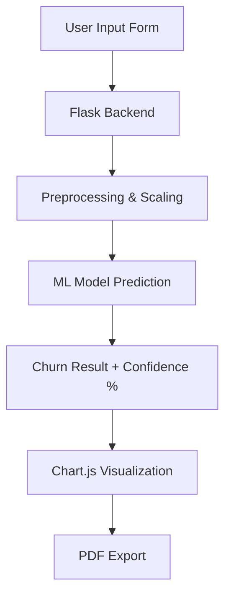

# 🔍 Customer Churn Predictor

> An intelligent AI/ML-based web application that enables businesses to **predict customer churn** by analyzing behavioral and billing patterns. Designed with a clean Tailwind-powered UI, real-time visualizations, and PDF export capabilities, this tool streamlines retention strategies for telecom and subscription-based industries.

---
## 🔍 Overview

Customer churn refers to when an existing customer stops doing business with a company. This predictor uses a **supervised machine learning pipeline** to analyze structured customer data and forecast churn probability with precision. The app serves as a decision-support system for customer success teams.

---

## ⚙️ Architecture

---
## 📸 UI Snapshots
---

## 🚀 Features

<table>
  <tr>
    <td>🔍 <strong>ML Prediction</strong></td>
    <td>Classifies if a customer will churn based on form inputs</td>
  </tr>
  <tr>
    <td>📋 <strong>Simple Input Form</strong></td>
    <td>Collects key customer details like tenure, billing, services</td>
  </tr>
  <tr>
    <td>📊 <strong>Charts</strong></td>
    <td>Interactive Bar, Doughnut, and Polar Area charts</td>
  </tr>
  <tr>
    <td>🧾 <strong>PDF Export</strong></td>
    <td>Download results & visuals in a clean report</td>
  </tr>
  <tr>
    <td>🎨 <strong>Modern UI</strong></td>
    <td>Tailwind CSS, gradient background, AOS & particles</td>
  </tr>
  <tr>
    <td>📱 <strong>Responsive Design</strong></td>
    <td>Works across all screen sizes and devices</td>
  </tr>
  <tr>
    <td>⚙️ <strong>Flask Backend</strong></td>
    <td>Runs a trained machine learning pipeline in Python</td>
  </tr>
</table>

---

## 🛠️ Tech Stack

| 💡 Layer         | 🚀 Technologies                                                                 |
|------------------|----------------------------------------------------------------------------------|
| 🌐 **Frontend**   |     |
| 🔙 **Backend**    |   |
| 🧠 **ML Model**   |     |
| 📊 **Visualization** |  |
| 📎 **Export**      |  |
| ✨ **Aesthetics**   |  |
